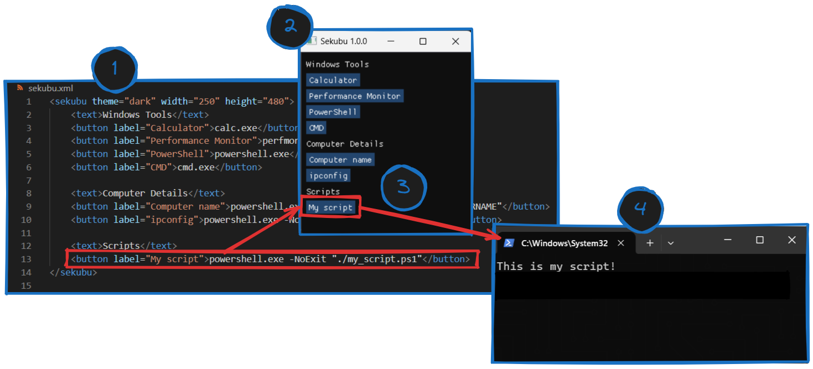

# Sekubu

Sekubu is a simple GUI command and/or script runner.

## How it works

1) Edit the config file `sekubu.xml`  and define your commands or scripts (the example config file will be generated after the first run). See the config description below.
2) Run the application. It's just a simple window containing buttons and other elements that you have defined in the config file.
3) Click the button to run the command.
4) Your command was executed!

## Configuration `sekubu.xml`

You can add these elements:

**Button** is the foundation of Sekubu. You have to set the command that will be run and label of the button as well.

    <button label="Click me!">run_this_app.exe</button>

* *Attributes:*

  * `label`
  * `new_console` *[default: True]*: runs the command in a new window (`subprocess.CREATE_NEW_CONSOLE`) or in background (`subprocess.CREATE_NO_WINDOW`)
  * `show_output` *[default: 'never']*: shows `stdout` in a modal dialog if `new_console=false`, possible options are:
    * `never`
    * `always`
    * `if_not_empty`

**Text** can be used as a section separator or for some fancy notes.

    <text>Some fancy text note</text>

**Separator** is just a horizontal line. Can be useful in case of a big amount of buttons.

    <separator/>

You can set `light` or `dark` theme in the root element `<sekubu>`. Don't worry about `width` and `height`, you can resize the window with the mouse and the size will be saved.

    <sekubu theme="dark" width="264" height="303">

## Examples

You can run any app the same way as within the Windows Run:

    <button label="Calculator">calc.exe</button>

Executing PowerShell script with `-NoExit` tag so the window will not close after the script finishes:

    <button label="My script">powershell.exe -NoExit "./my_script.ps1"</button>

It's also possible to just run commands right from the app (`ipconfig /all` in this case):

    <button label="ipconfig">powershell.exe -NoExit -Command "ipconfig /all"</button>

Run the command in background and show stdout after it's executed:
    
    <button label="Hello World!" new_console="false" show_output="if_not_empty">powershell.exe -Command "Write-Host 'Hello World!'"</button>

## Changelog

*1.1.4*

* Command can be executed in background using new attribute `new_console`

*1.0*

* First version of Sekubu released!