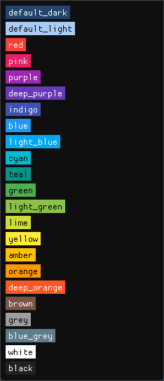

# Sekubu

Sekubu is a simple GUI command and/or script runner.

## How it works

1) Edit the config file `sekubu.xml` and define your commands or scripts (an example config file will be generated after the first run). See the config description below.
2) Run the application. It's just a simple window containing buttons and other elements that you have defined in the config file.
3) Click a button to run its associated command.
4) Your command is executed!


## Configuration `sekubu.xml`

You can add these elements:

### Button

**Button** is the foundation of Sekubu. You must set the command that will be run and the label of the button.

```xml
<button label="Click me!">run_this_app.exe</button>
```

* *Attributes:*

  * `label`: label of the button
  * `new_console` *[default: True]*: runs the command in a new window (`subprocess.CREATE_NEW_CONSOLE`) or in the background (`subprocess.CREATE_NO_WINDOW`)
  * `show_output` *[default: 'never']*: shows `stdout` in a modal dialog if `new_console=false`, possible options are:
    * `never`
    * `always`
    * `if_not_empty`
  * `color`: color of the button (can be chosen from the [color palette](#color-palette))

### Text

**Text** can be used as a section separator or for notes.

```xml
<text>Some fancy text note</text>
```

### Separator

**Separator** is just a horizontal line. It can be useful when you have a large number of buttons.

```xml
<separator/>
```

### Configuration

The root element `<sekubu>` is used for various customizations.

* `width` and `height`: window size (don't worry about these, you can resize the window with the mouse and the size will be saved)
* `theme`: there are two available themes - `light` or `dark`
* `color`: default color of the buttons (can be chosen from the [color palette](#color-palette))

```xml
<sekubu width="264" height="303" theme="dark" color="pink">
```

## Color palette

Available colors: `red`, `pink`, `purple`, `deep_purple`, `indigo`, `blue`, `light_blue`, `cyan`, `teal`, `green`, `light_green`, `lime`, `yellow`, `amber`, `orange`, `deep_orange`, `brown`, `grey`, `blue_grey`, `white`, `black`, `default_light`, `default_dark`



## Examples

You can run any app the same way as you would with Windows Run:

```xml
<button label="Calculator">calc.exe</button>
```

Execute a PowerShell script with `-NoExit` parameter so the window will not close after the script finishes:

```xml
<button label="My script">powershell.exe -NoExit "./my_script.ps1"</button>
```

Run commands directly from the app (`ipconfig /all` in this example):

```xml
<button label="ipconfig">powershell.exe -NoExit -Command "ipconfig /all"</button>
```

Run a command in the background and show stdout after it's executed:
    
```xml
<button label="Hello World!" new_console="false" show_output="if_not_empty">powershell.exe -Command "Write-Host 'Hello World!'"</button>
```

Run a Python script:

```xml
<button label="Python script">powershell "C:\...\python.exe .\my_python_script.py"</button>
```

Run a script using Windows Terminal:

```xml
<button label="Windows Terminal">wt powershell.exe "./my_script.ps1"</button>
```

Run a script inside a specific location/folder:

```xml
<button label="My script">powershell "Set-Location C:\my_folder\; ./my_script.cmd"</button>
```

Open a local folder in Windows Explorer:

```xml
<button label="Open C:\my_folder">explorer "C:\my_folder"</button>
```

Open a network folder in Windows Explorer:

```xml
<button label="Open Network Folder">explorer "\\\\network_path\\folder"</button>
```

## Run or build from the code

You don't need to build the application to use it. You can find the executable in [Releases](https://github.com/rotten77/sekubu/releases).

To run from source, first clone the repository and install the requirements:

```
pip install -r requirements.txt
```

Then you can run Sekubu by calling the main script:
    
```
python ./sekubu/
```

Or you can build it using the prepared command file:

```
build.cmd
```

## Changelog

*1.2.0*

* Added option to select color of the buttons.

*1.1.4*

* A command can be executed in the background using the new attribute `new_console`.

*1.0*

* The first version of Sekubu.